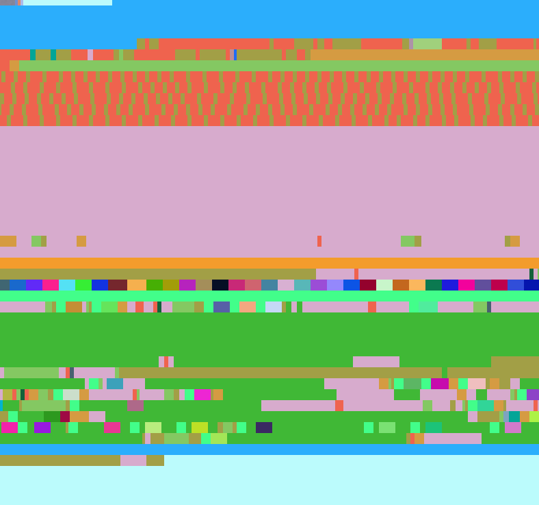

# Squeak Image Loader

```javascript
var data;
(async () => {
  data = await fetch("http://localhost:9005/Dropbox/hpi/Squeak/Tracing/aws-final.image").then(r => r.arrayBuffer())
})()


import ImageLoader from "https://lively-kernel.org/lively4/cloud-squeak/image-loader/image-loader.js"
var imageLoader = new ImageLoader()
imageLoader.readFromBuffer(data)

Object.keys(imageLoader.tally).length

var sum = 0
for (var c of Object.values(imageLoader.tally)) {
    sum += c.total
}
sum 5 974 144


var count = 0
for (var c of Object.values(imageLoader.tally)) {
    count += c.count
}
count 48462


Object.values(imageLoader.tally).sortBy(ea => ea.classID).slice(0,20)


Object.values(imageLoader.tally).sortBy(ea => ea.classID).reverse().slice(0,20)


var dataView = new DataView(data)

a.length

var s = ""
for (var i=19; i < 100; i++) {
  s += String.fromCharCode(dataView.getUint8(i))  
}
s


dataView.get

```

```javascript
var data;
(async () => {
  if (!data) {
    data = await fetch("http://localhost:9005/Dropbox/hpi/Squeak/Tracing/aws-final.image").then(r => r.arrayBuffer())
  }
})()

// (async () => {
//   data = null
//   data = await fetch("http://localhost:9005/Dropbox/hpi/Squeak/Tracing/Squeak6.1alpha-22475-64bit.image").then(r => r.arrayBuffer())
// })()


import ImageLoader from "https://lively-kernel.org/lively4/cloud-squeak/image-loader/image-loader.js"
var imageLoader = new ImageLoader()
imageLoader.readFromBuffer(data)

var target = document.body.querySelector("#Viz")

// target.style.transformOrigin = "0 0"
// target.style.transform = "scale(1)"

imageLoader.canvas.style.width = (2048 * 1) +"px"
imageLoader.canvas.style["image-rendering"] = 'pixelated';


target.innerHTML = ""
target.appendChild(imageLoader.canvas)


// Object.values(imageLoader.tally).sortBy(ea => ea.classID).slice(0,20)[1].data[1].length
// Object.values(imageLoader.tally).sortBy(ea => ea.classID).slice(0,20)[1].oops[1].bytes
// Object.values(imageLoader.tally).sortBy(ea => ea.classID).slice(0,20)[1].oops

```




# SqueakJS

```javascript
import "https://squeak.js.org/squeak.js"


// Run image by starting interpreter on it
function runImage(imageData, imageName, options) {

    // Create Squeak image from raw data
    var image = new Squeak.Image(imageName.replace(/\.image$/i, ""));
    var display = { vmOptions: [ "-vm-display-null", "-nodisplay" ], 
                  context: document.createElement("canvas").getContext('2d'),
                  keys: []
                  };
        
    image.readFromBuffer(imageData, function startRunning() {

        // Create fake display and create interpreter
        var vm = new Squeak.Interpreter(image, display);
        function run() {
            try {
                vm.interpret(50, function runAgain(ms) {
                    // Ignore display.quitFlag when requested.
                    // Some Smalltalk images quit when no display is found.
                    if(options.ignoreQuit || !display.quitFlag) {
                        setTimeout(run, ms === "sleep" ? 10 : ms);
                    } else {
                      console.log("quit squeak")
                    }
                });
            } catch(e) {
                console.error("Failure during Squeak run: ", e);
            }
        }

        // Start the interpreter
        run();
    });
  
    return display
}


var data;
(async () => {
  if (!data) {
    //   data = null
    data= await fetch("http://localhost:9005/Dropbox/hpi/Squeak/Tracing/aws-final.image").then(r => r.arrayBuffer())
  }
})()


Squeak.Primitives.prototype.js_fromStObject =  function(obj) {
            if (typeof obj === "number") return obj;
            if (obj.jsObject) return obj.jsObject;
            if (obj.isFloat) return obj.float;
            if (obj.isNil) return null;
            if (obj.isTrue) return true;
            if (obj.isFalse) return false;
            if (obj.bytes || obj.sqClass === this.vm.specialObjects[Squeak.splOb_ClassString])
                return obj.bytesAsString();
            if (obj.sqClass === this.vm.specialObjects[Squeak.splOb_ClassArray])
                return this.js_fromStArray(obj.pointers || [], true);
            if (obj.sqClass === this.vm.specialObjects[Squeak.splOb_ClassBlockContext] ||
                obj.sqClass === this.vm.specialObjects[Squeak.splOb_ClassBlockClosure] || 
                obj.sqClass === this.vm.specialObjects[Squeak.splOb_ClassFullBlockClosure] 
               )
                return this.js_fromStBlock(obj);
            throw Error("asJSArgument needed for " + obj);
}

var display = runImage(data, "aws-final.image" ,  {});

// SqueakJS patches:


  
// display.quitFlag = true

// #TODO #ContinueHere this works with an old image?

debugger
sqPlus(3, 4)RESOLVED: Error: Error: newMethod:header: failed


sqEval


```


