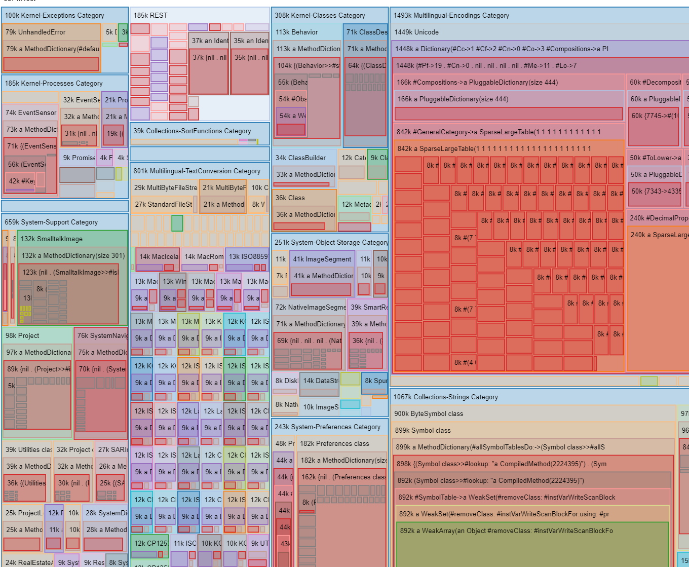

<!-- markdown-config presentation=true -->

Mini Image for a Cloud Squeak

(Short Experience Report)

  <u>Jens Lincke</u>, Tom Beckmann, Robert Hirschfeld

  2023 
   
  Software Architecture Group  Hasso Plattner Institute  University of Potsdam, Germany

---

# Motivation / Background

- Cloud functions
  - Deploy in cloud
  - When required a server is booted
  - Software is executed for a short time (15min)
  - Then shut down....
- This is not ideal for Squeak....
  - Image is big and Cloud Functions are charged by mainly RAM ...
- Goal: **Can we make a smaller Squeak Image?**

---

# Challenge

- How far can we shrink a Squeak Image?
- Manually shrink vs automatic shrink?
- Usable image vs throwaway image 
  - Marcel's vs. our approach

---

# Our Approach

- Create a script that shrinks any dev image to a minified one for the cloud
- The resulting image needs only to be capable of running the application code

--- 
##  1. Get a way to interact with Squeak not through the UI

- Install Telnet (because shell IO is to blocking)
- Use automatic script to shrink image

--- 
##  2. Repeat

- Uninstall parts of Squeak and see if the parts we are interested still work
  - Start with big image and produce mini image by running script
  - Run various analysis and visualizations (in the minimized target image )
  - Identify potential next targets for removal
  - add them those to shrinking script
- Produce JSON data in Squeak 
- External visualization (in Lively4)
http://localhost:9005/Dropbox/hpi/Squeak/Tracing/lively/treemap.md?file=../aws-report.json

--- 

## 3. Mini image file size diverges from analysis and visualization 

- Problem: Image on hard disk is much bigger than it should be

--- 

## 4. Analyze mini image directly 

- Use image loader from SqueakJS
- Visualize all objects as pixels on a canvas  [(AWS Final Image Visualization)](../image-loader/image-vis.md) 
 - 
- Discuss Findings on Mailing List / Hand over to VM Devs

---

## Limitations 

- No dynamic or static dependency tracing....
- Dependencies (things that should not be removed) have to be manually added to the shrink script
  - e.g. all code that is necessary to analyze / produce the visualizations needed to be on the ignore list
  
  

---

# Conclusion / Insights

- Open Challenge: How to make a nice non-blocking shell version of squeak
  - [new squeak issue](https://github.com/squeak-smalltalk/squeak-object-memory/issues/98)
  - (To replace telnet client)
- Squeak Image can be reduced quite a lot
- Actually using the minified image ... another day perhaps 

---
<!-- #TODO pull this up into presentation? -->
